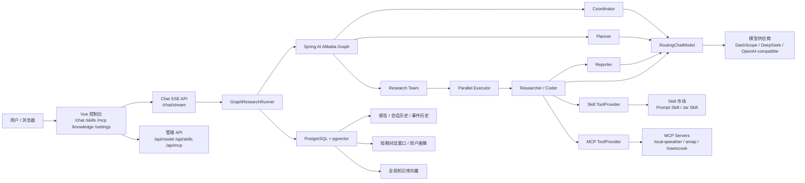
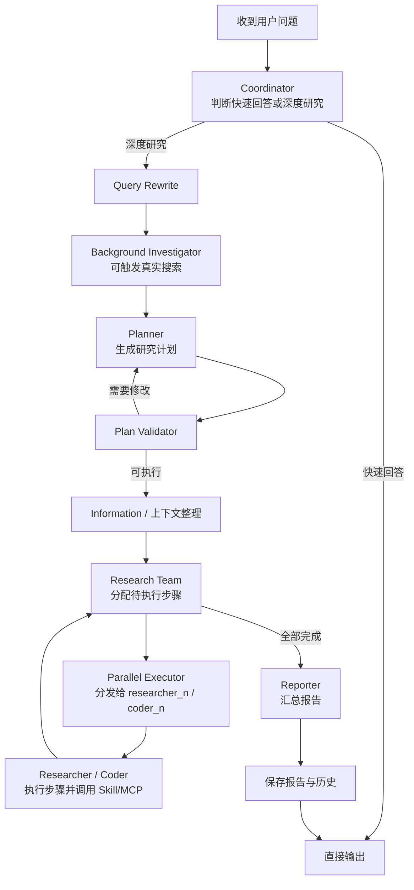

# M-Agent

M-Agent 是一个**完整可用的 DeepResearch 风格 AI Agent 工作流引擎**，集成了多模型供应商切换、WebFlux SSE 流式输出、PostgreSQL 持久化、Skill 市场、MCP 工具接入、RAG 检索增强和研究流程编排等核心能力。

**一句话概括**：输入一个研究问题，M-Agent 自动拆解计划、并行执行多步研究、调用外部工具、汇总报告，全程流式可视。

## 核心特性

| 特性 | 说明 |
|------|------|
| **多模型支持** | DeepSeek、MiniMax、Moonshot、智谱、DashScope，运行时热切换 |
| **深度研究工作流** | Coordinator → Planner → Research Team → Parallel Executor → Reporter 全链路 |
| **SSE 流式推送** | 双通道事件流，毫秒级进度感知 |
| **RAG 检索增强** | pgvector 向量存储，支持全局知识库和会话级文档 |
| **MCP 工具协议** | 标准 MCP 协议接入外部服务（天气、地图、菜谱等） |
| **Skill 插件市场** | Prompt Skill + Jar Skill，运行时热插拔 |
| **用户画像** | LLM 自动提取四维画像，支持手动覆盖 |
| **中断恢复** | 检查点-恢复机制，支持人工介入后从断点续跑 |
| **全链路持久化** | 报告、会话历史、事件、对话消息、用户画像全部入库 |

## 技术栈

- **后端**：Java 17、Spring Boot 3.4.x、WebFlux、R2DBC、Flyway
- **Agent 编排**：Spring AI 1.0.0、Spring AI Alibaba Graph
- **模型**：OpenAI-compatible 协议，支持 DeepSeek / MiniMax / Moonshot / 智谱 / DashScope
- **持久化**：PostgreSQL 17 + pgvector 向量存储
- **前端**：Vue 3、Vite、Pinia、Ant Design Vue
- **容器化**：Docker Compose 一键部署（前端 + 后端 + 数据库 + MCP）

## 架构图



## Agent 工作流



## Agent Team 协作

研究工作流中的节点按角色分为三类，前端时间线按角色分组展示：

| 角色 | 包含节点 | 职责 |
|------|---------|------|
| Planner | coordinator、planner、plan_validator、human_feedback | 理解需求、制定计划、确认计划 |
| Executor | research_team、parallel_executor、researcher_N、coder_N、information、background_investigator | 分配任务、执行步骤、调用 Skill/MCP |
| Reviewer | reporter | 汇总报告、检查遗漏 |

SSE 事件中的 `agent_role` 字段标识每个事件所属角色。前端时间线按角色分组、颜色区分：Planner（紫色）、Executor（蓝色）、Reviewer（绿色）。

## 短期记忆

采用**会话级滑动窗口**策略，以极简实现精准保留最近相关上下文，保证多轮交互的语义连贯性。

同一 `session_id` 下最近的对话消息按时间排序注入 Coordinator、Planner 和 Reporter 的 prompt，帮助 LLM 理解追问意图与上下文关联。每条消息硬截断至 800 字符、窗口上限 20 条，将 Token 消耗与计算延迟严格控制在常数级，从机制上杜绝模型上下文溢出。消息写入采用异步降级策略（`.onErrorResume`），持久化失败静默丢弃，不阻塞主研究流程。

prompt 中内嵌护栏指令——"Use this only to adapt explanation depth and style. Do not infer facts not present in research evidence"——强制 LLM 将对话历史限定为风格参考而非事实来源，防止记忆污染与幻觉传播。

## 长期记忆

构建 **LLM 驱动的结构化用户画像引擎**，从对话流中自动提炼跨会话的用户特征，实现从"一次性问答"到"渐进式理解"的体验跃迁。

`UserProfileService` 定期从最近消息中提取四维结构化画像：`profile_summary`（身份摘要）、`expertise_level`（专业水平）、`detail_preference`（详略偏好）、`style_preference`（内容风格）。提取结果经 Set 白名单校验后落入 `user_profiles` 表——非法枚举值静默忽略，LLM 解析失败不抛异常，保证画像管线鲁棒可降级。

缓存策略采用 TTL 惰性刷新：60 分钟内直接命中缓存，避免冗余 LLM 调用；超时后取最近 10 条消息做增量更新，新旧画像合并而非全量重建。画像同步注入 Coordinator（辅助判断问题复杂度与路由决策）和 Reporter（自适应调节报告深度与行文风格），注入格式附带与短期记忆同源的护栏约束。

**用户画像支持手动覆盖**：前端知识库页面提供可视化编辑，手动修改的字段不被自动提取覆盖，实现"系统自动 + 人工精调"的混合画像策略。

## 插件化 Skill

设计 **可热插拔的 Skill 插件架构**，将工具能力从 Agent 核心逻辑中解耦，实现"能力即插件、插件即市场"的开放式工具生态。

两类 Skill 统一通过 `SkillToolProvider` 注册为 LLM 的 function calling 工具集：

| 类型 | 组成 | 定位 |
|------|------|------|
| Prompt Skill | `skill.json` + `SKILL.md` | 零代码模板化技能，适合规则明确的任务指令 |
| Jar Skill | `skill.json` + `plugin.jar` | 全能力 Java 插件，通过 `SkillPlugin` SPI + ServiceLoader 接入 |

核心机制：
- **运行时热切换**：`PATCH /api/skills/{name}/toggle` 毫秒级启停，无需重启 JVM
- **ClassLoader 级隔离**：`SkillPluginClassLoader` 为每个 Jar Skill 创建独立类加载器
- **声明式健康探针**：`GET /api/skills/{name}/health` 在注册前验证插件可用性

## MCP

接入 **Model Context Protocol（MCP）标准协议**，以统一的工具描述语言打通异构外部服务，让 LLM 在单一协议层面对多源工具进行语义级发现与调用。

支持 SSE 和 Streamable HTTP 两种传输协议，支持自定义 Headers 和 API Key 认证，可直接接入 ModelScope 等 MCP 服务市场。

核心机制：
- **启动时自动发现**：连接 MCP Server → 拉取 `tools/list` → 注册到全局工具注册表
- **运行时热重载**：`POST /api/mcp/reload` 在不下线服务的前提下刷新工具清单
- **声明式配置**：`mcp-config.json` 集中管理所有 MCP Server 的连接参数与启停状态

## RAG

构建 **检索增强生成（RAG）管线**，将外部知识检索作为图工作流的一等公民节点嵌入，在 LLM 推理之前注入语义相关的外部证据。

**全局知识库**：用户在前端知识库页面上传的文档对所有会话生效，支持文档列表查看和删除。`RagRetriever` 自动合并全局文档和会话级文档的检索结果。

两个可选 RAG 节点覆盖双重检索场景：

| 节点 | 触发条件 | 检索目标 |
|------|---------|---------|
| `USER_FILE_RAG` | `rag.enabled=true` 且用户上传文件 | 用户私有文档 + 全局知识库语义检索 |
| `PROFESSIONAL_KB_RAG` | 用户选定专业知识库 | 领域知识库定向检索 |

## 向量数据库

在 PostgreSQL 上启用 **pgvector 扩展**，将向量存储与关系型业务数据置于同一数据库引擎内，以零额外基础设施实现高维语义嵌入的存储与近似最近邻（ANN）检索。

Spring AI 的 `PgVectorStore` 提供开箱即用的向量写入与余弦相似度查询。嵌入向量由 DashScope 统一生成——用户上传文档经 Tika 解析 → 分块 → 向量化 → 写入 pgvector，形成完整的非结构化数据到结构化语义索引的转换链路。

## 中断恢复

实现 **有状态工作流的检查点-恢复（Checkpoint-Resume）机制**，让长时运行的深度研究任务在人工介入或异常中断后从精确断点续跑，而非全量重启。

系统支持两个语义化暂停锚点：

| 暂停点 | 触发条件 | 用户操作 |
|--------|---------|---------|
| 计划确认 | Plan Validator 完成校验，路由至 `HUMAN_FEEDBACK` | 接受计划 / 提出修改意见 / 拒绝 |
| 人工反馈 | 工作流中显式等待用户决策 | 注入反馈内容并决定后续路由 |

整个生命周期由 `research_session_histories` 表追踪完整状态机：`RUNNING → PAUSED → RUNNING → COMPLETED / STOPPED / FAILED`。

## 快速开始（Docker 一键部署）

### 前置条件

- Docker Desktop 已安装并启动
- 已配置模型供应商 API Key

### 1. 配置 API Key

编辑 `.local/model-providers.json`，填入你的 API Key：

```json
{
  "deepseek": "sk-你的DeepSeek-Key",
  "minimax": "sk-api-你的MiniMax-Key",
  "dashscope": "sk-你的DashScope-Key"
}
```

编辑 `.local/mcp-keys.json`，配置 MCP 服务 Key：

```json
{
  "QWEATHER_API_KEY": "你的和风天气Key",
  "AMAP_MAPS_API_KEY": "你的高德地图Key"
}
```

### 2. 一键启动

```bash
docker compose up -d
```

### 3. 访问应用

| 服务 | 地址 |
|------|------|
| 前端 | http://localhost |
| 后端 API | http://localhost:8080 |
| 和风天气 MCP | http://localhost:18090 |

### 4. 查看日志

```bash
# 查看后端日志
docker compose logs -f backend

# 查看所有服务日志
docker compose logs -f
```

### 5. 停止服务

```bash
docker compose down
```

## Docker 服务架构

```
┌─────────────────────────────────────────────────────────┐
│                    docker compose                        │
├─────────────────────────────────────────────────────────┤
│  postgres:5432  ←──  backend:8080  ←──  frontend:80    │
│                          │                              │
│                    qweather-mcp:18090                   │
└─────────────────────────────────────────────────────────┘
```

| 服务 | 镜像 | 端口 | 说明 |
|------|------|------|------|
| postgres | postgres:17-alpine | 5432 | PostgreSQL 数据库 + pgvector |
| backend | 自构建 | 8080 | Spring Boot 后端 |
| frontend | 自构建 | 80 | Vue 3 + Nginx |
| qweather-mcp | 自构建 | 18090 | 和风天气 MCP 服务 |

`.local/` 目录通过 volume 挂载到后端容器，API Key 无需重新配置。

## 常用验证命令

> 各特性的详细说明见上文对应章节。以下为快速验证命令（假设服务运行在 localhost）。

### 能力开关

```bash
curl http://localhost:8080/api/app/capabilities
```

### 模型切换

```bash
# 查看当前模型
curl http://localhost:8080/api/model/current

# 切换到 DeepSeek
curl -X POST http://localhost:8080/api/model/switch \
  -H "Content-Type: application/json" \
  -d '{"providerId":"deepseek","modelName":"deepseek-chat"}'
```

### MCP 状态和天气工具

```bash
# MCP 状态
curl http://localhost:8080/api/mcp/status

# 查询天气
curl -X POST http://localhost:8080/api/mcp/tools/weather_now/invoke \
  -H "Content-Type: application/json" \
  -d '{"location":"Beijing"}'
```

### 深度研究 SSE

```bash
curl -N -H "Content-Type: application/json" \
  -d '{"query":"解释 Agent 工作流为什么要区分 Planner、Researcher 和 Reporter","session_id":"demo","enable_deepresearch":true,"auto_accepted_plan":true}' \
  http://localhost:8080/chat/stream
```

### 知识库 API

```bash
# 上传全局文档
curl -X POST "http://localhost:8080/api/rag/upload?scope=global" \
  -F "file=@test.txt" -F "session_id=__global__" -F "user_id=global"

# 查看全局文档列表
curl "http://localhost:8080/api/rag/documents?scope=global"

# 查看用户画像
curl http://localhost:8080/api/user-profile
```

## 本地开发（非 Docker）

如需本地开发调试，可单独启动各组件：

```bash
# 1. 启动 PostgreSQL
docker compose up -d postgres

# 2. 配置 Key（同上）

# 3. 启动和风天气 MCP
cd tools/local-qweather-mcp && npm install && npm run build && npm start

# 4. 启动后端
export JAVA_HOME=/path/to/jdk17
mvn spring-boot:run

# 5. 启动前端
cd ui-vue3 && npm install && npm run dev
```

## 测试

```bash
# 后端测试
mvn test

# 前端测试
cd ui-vue3 && npm run test:unit

# MCP 测试
cd tools/local-qweather-mcp && npm test
```

## 安全与提交约束

- 不提交 `.local/`、`target/`、`.idea/`、`.claude/`
- 不在源码、测试断言、README 或提交记录中写入 API Key
- Jar Skill 仅用于本地可信插件，ClassLoader 隔离不等于安全沙箱

## License

MIT
