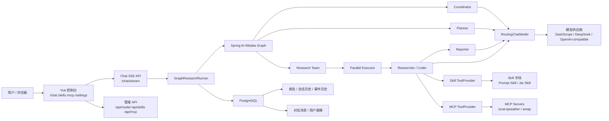
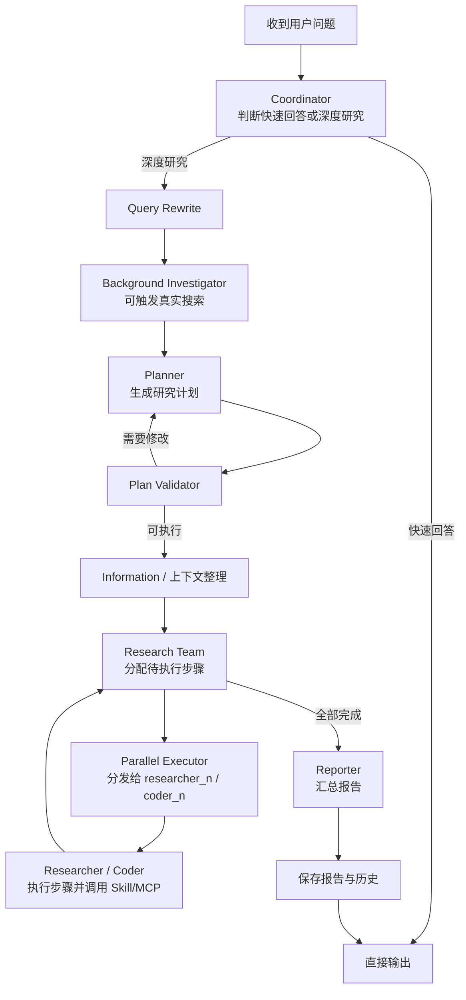

# M-Agent 学习项目

M-Agent 是一个面向学习和演示的 Java Agent 后端与 Vue 控制台项目。它以 DeepResearch 风格的工作流为核心，展示模型供应商切换、WebFlux SSE 流式输出、PostgreSQL 持久化、Skill 市场、MCP 工具接入和研究流程编排。

当前项目的定位是“精简但可运行”的教学工程：优先保留真实模型、真实数据库和真实 MCP 工具路径，不使用 mock agent 或 mock search fallback。

## 技术栈

- 后端：Java 17、Spring Boot 3.4.x、Maven、WebFlux、R2DBC、Flyway
- Agent 编排：Spring AI、Spring AI Alibaba Graph
- 模型：DashScope 与 OpenAI-compatible provider，例如 DeepSeek、MiniMax、Moonshot、智谱等
- 持久化：PostgreSQL，包含报告、会话历史、事件历史、对话消息、用户画像
- 工具与扩展：Skill 市场、本地 Jar Skill 插件接口、MCP Client
- 前端：Vue 3、Vite、Pinia、Ant Design Vue
- 本地 MCP 示例：`tools/local-qweather-mcp`，提供 `weather_now` 实时天气工具

## 当前完成度

已具备：

- 模型供应商列表、API Key 保存、运行时模型切换和连通性测试。
- WebFlux SSE 对话与研究流接口。
- PostgreSQL 会话消息、报告、事件历史、用户画像和历史报告上下文。
- Skill 注册、发现、创建、更新、导入、导出、启用/禁用、重载、卸载、健康检查和调用历史。
- Jar Skill 上传热加载的后端能力，但默认关闭，仅建议本地可信启用。
- MCP Server 管理、连接测试、reload 和工具调试调用。
- Vue 控制台：`/chat`、`/skills`、`/mcp`、`/settings`。
- DeepResearch 风格图工作流，包含 Coordinator、Planner、Research Team、Parallel Executor、Researcher、Coder、Reporter 等节点。

待补齐：

- 根需求中的“短期对话窗口进入模型推理上下文”仍需 Phase 2 完成；当前已保存并可格式化会话历史。
- 3 个方向 Skill 演示需要补齐计算器和网络搜索 Skill；当前内置 Skill 为天气、地点分析、代码审查。
- Agent Team 高分项目前是研究图工作流能力，仍需独立活动策划 Demo、Reviewer 语义和展示说明。
- Demo 视频不在仓库中，本仓库先提供可复现录制脚本。

## 架构图



## Agent 工作流



后续 Agent Team 高分 Demo 将在此基础上补齐“活动策划”场景，把 Planner / Executor / Reviewer 的角色、任务分发和状态流展示得更清晰。

## 本地启动

### 1. 启动 PostgreSQL

先确认 Docker Desktop 已启动，然后在仓库根目录执行：

```powershell
docker compose up -d postgres
docker ps --format "{{.Names}}\t{{.Status}}\t{{.Ports}}"
```

期望看到 `manmu-postgres` 为 `healthy`，并映射 `5432`。

### 2. 配置模型 Key

不要把 Key 写入源码或提交记录。推荐通过控制台或接口保存：

```powershell
curl.exe -X POST http://localhost:18080/api/model/providers/deepseek/key `
  -H "Content-Type: application/json" `
  --data-binary "{\"apiKey\":\"你的 Key\"}"
```

本地敏感配置位于 `.local/`，该目录已被 `.gitignore` 忽略。

### 3. 启动本地和风天气 MCP

如需演示 `weather-now` Skill 或 `weather_now` MCP 工具，先配置和风天气 Key：

```powershell
New-Item -ItemType Directory -Force .local | Out-Null
'{"QWEATHER_API_KEY":"你的和风天气 Key"}' | Set-Content -Encoding UTF8 .local/mcp-keys.json
```

启动 MCP Server：

```powershell
cd tools/local-qweather-mcp
npm install
npm run build
npm start
```

默认监听 `http://127.0.0.1:18090/sse`。

### 4. 启动后端

```powershell
$env:JAVA_HOME='C:\WorkResources\JDKs\JDK17'
$env:PATH="$env:JAVA_HOME\bin;$env:PATH"
mvn spring-boot:run "-Dspring-boot.run.arguments=--server.port=18080"
```

Jar Skill 默认关闭。仅在本地可信演示时临时启用：

```powershell
mvn spring-boot:run "-Dspring-boot.run.arguments=--server.port=18080 --mvp.skill.jar-plugins.enabled=true"
```

### 5. 启动前端

```powershell
cd ui-vue3
npm install
npm run dev
```

常用页面：

- `http://localhost:5173/chat`
- `http://localhost:5173/skills`
- `http://localhost:5173/mcp`
- `http://localhost:5173/settings`

## 常用验证

### 能力开关

```powershell
curl.exe http://localhost:18080/api/app/capabilities
```

### 模型供应商与切换

```powershell
curl.exe http://localhost:18080/api/model/providers
curl.exe http://localhost:18080/api/model/current
'{"providerId":"deepseek","modelName":"deepseek-chat"}' | Set-Content -Encoding UTF8 target/http-check/model-switch.json
curl.exe -X POST -H "Content-Type: application/json" --data-binary "@target/http-check/model-switch.json" http://localhost:18080/api/model/switch
```

### Skill 市场

```powershell
curl.exe http://localhost:18080/api/skills
curl.exe http://localhost:18080/api/skills/weather-now/health
curl.exe -X PATCH http://localhost:18080/api/skills/weather-now/toggle
curl.exe -X PATCH http://localhost:18080/api/skills/weather-now/toggle
```

### MCP 状态和天气工具

```powershell
curl.exe http://localhost:18080/api/mcp/status
curl.exe -X POST http://localhost:18080/api/mcp/reload
'{"location":"上海"}' | Set-Content -Encoding UTF8 target/http-check/weather-now-request.json
curl.exe -X POST -H "Content-Type: application/json" --data-binary "@target/http-check/weather-now-request.json" http://localhost:18080/api/mcp/tools/weather_now/invoke
```

### 聊天 SSE

```powershell
New-Item -ItemType Directory -Force target/http-check | Out-Null
'{"message":"@weather-now 查询上海实时天气","session_id":"demo-session","enable_deepresearch":false}' | Set-Content -Encoding UTF8 target/http-check/chat-weather.json
curl.exe -N -H "Content-Type: application/json" --data-binary "@target/http-check/chat-weather.json" http://localhost:18080/chat/stream > target/http-check/chat-weather.sse
```

### 深度研究 SSE 与持久化

```powershell
'{"message":"解释为什么 Agent 工作流要区分 Planner、Researcher 和 Reporter。","session_id":"research-demo","enable_deepresearch":true,"auto_accepted_plan":true}' | Set-Content -Encoding UTF8 target/http-check/research.json
curl.exe -N -H "Content-Type: application/json" --data-binary "@target/http-check/research.json" http://localhost:18080/chat/stream > target/http-check/research.sse
curl.exe http://localhost:18080/api/sessions/research-demo/history > target/http-check/research-history.json
curl.exe http://localhost:18080/api/reports/session/research-demo > target/http-check/research-reports.json
```

## 测试

后端：

```powershell
$env:JAVA_HOME='C:\WorkResources\JDKs\JDK17'
$env:PATH="$env:JAVA_HOME\bin;$env:PATH"
mvn test
```

前端：

```powershell
cd ui-vue3
npm run test:unit
npm run build
```

本地 MCP：

```powershell
cd tools/local-qweather-mcp
npm test
npm run build
```

## Skill 开发

详见 [Skill 开发指南](docs/skill-development-guide.md)。

当前支持两类 Skill：

- Prompt Skill：`skill.json + SKILL.md`，适合模板化任务说明。
- Jar Skill：`skill.json + plugin.jar`，通过 `SkillPlugin` 和 `ServiceLoader` 接入，默认关闭，仅用于本地可信插件。

## MCP 配置

详见 [MCP 工具配置](docs/mcp-tools.md)。

内置配置位于 `src/main/resources/mcp-config.json`：

- 高德 MCP：默认关闭，需要 `AMAP_MAPS_API_KEY`。
- 本地和风天气 MCP：默认启用，连接 `http://127.0.0.1:18090/sse`，需要启动 `tools/local-qweather-mcp`。

## Demo 录制

详见 [Demo 脚本](docs/demo-script.md)。建议录制以下路径：

1. 模型供应商查看和切换。
2. Skill 市场查看、健康检查、启停和显式调用。
3. MCP 页面连接测试和 `weather_now` 调试。
4. 深度研究 SSE 过程、报告与会话历史持久化。
5. Agent Team 活动策划流程（Phase 6 完成后录制）。

## 安全与提交约束

- 不提交 `.local/`、`target/`、`.idea/`、`.claude/`。
- 不在源码、测试断言、README 示例输出或提交记录中写入 API Key。
- Jar Skill 不是安全沙箱。ClassLoader 隔离只用于本地可信插件的依赖和生命周期隔离。
- 真实 HTTP/SSE 验证后必须关闭后端服务，并确认 `18080` 端口释放。
