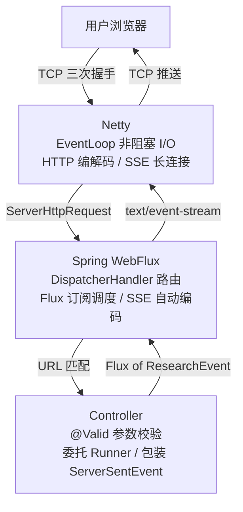
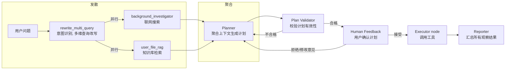

# M-Agent

M-Agent 是一个**完整可用的 DeepResearch 风格 AI Agent 工作流引擎**，集成了多模型供应商切换、WebFlux SSE 流式输出、PostgreSQL 持久化、Skill 市场、MCP 工具接入、RAG 检索增强和研究流程编排等核心能力。

**一句话概括**：输入一个研究问题，M-Agent 自动拆解计划、并行执行多步研究、调用外部工具、汇总报告，全程流式可视。

## 技术栈

- **后端**：Java 17、Spring Boot 3.4.x、WebFlux、R2DBC、Flyway
- **Agent 编排**：Spring AI 、Spring AI Alibaba Graph
- **模型**：OpenAI-compatible 协议，支持 DeepSeek / MiniMax / Moonshot / 智谱 / DashScope
- **持久化**：PostgreSQL 17 + pgvector 向量存储
- **前端**：Vue 3、Vite、Pinia、Ant Design Vue
- **容器化**：Docker Compose 一键部署（前端 + 后端 + 数据库 + MCP）

## 架构图

### 请求路由流程

从用户发起请求到 Controller 接收处理的完整链路：



**请求接收层核心机制**：

| 组件                    | 职责                                                    | 关键特性                                                 |
| ----------------------- | ------------------------------------------------------- | -------------------------------------------------------- |
| **Netty**               | TCP 连接管理、HTTP 协议解析、SSE 长连接维护             | EventLoop 模型，少量线程处理大量并发连接                 |
| **WebFlux**             | 请求路由、Flux 订阅调度、SSE 格式自动编码               | 检测 `TEXT_EVENT_STREAM_VALUE` 自动将 Flux 编码为 SSE    |
| **Controller**          | 参数校验（`@Valid`）、委托 Runner、包装 ServerSentEvent | 无业务逻辑，纯路由层                                     |
| **GraphResearchRunner** | 图执行编排、事件收集为 Flux、R2DBC 持久化时机控制       | 整条链路返回 `Flux<ResearchEvent>`，WebFlux 自动订阅推送 |
| **R2DBC**               | 非阻塞数据库访问，`save()` 返回 `Mono` 不阻塞线程       | 等待数据库响应期间线程可服务其他请求                     |

### 研究工作流

M-Agent 的研究计划本质上是一张有向图，采用 **GoT（Graph-of-Thought）** 图推理结构——先发散再收敛，允许多个分支的中间结论汇总合并成新结论：



# LLM 大脑

LLM 是整个 Agent 系统的中枢，负责理解用户意图、进行逻辑推理、生成行动计划、解读工具返回结果。M-Agent 通过 `RoutingChatModel` 接入多个模型供应商（DeepSeek、DashScope、MiniMax、Moonshot、智谱），并在此基础上构建了重试与自动降级机制保障可用性。

## 模型调用重试机制

LLM API 是整条链路中最不稳定的环节——限流（429）、服务不可用（503）、网络抖动、响应超时，任何一种都会直接中断研究流程。M-Agent 在 `SpringAiAgentClient.callWithRetryAndFallback()` 中实现了**指数退避重试**，对 `AgentClient` 接口签名零变更，`LlmResearcherAgent`、`LlmPlannerAgent` 等调用方无感知。

**重试策略**（`isRetryable()` 判断）：

| 异常类型                       | 是否重试 | 原因               |
| ------------------------------ | -------- | ------------------ |
| ReadTimeoutException           | ✅        | 网络/模型响应慢    |
| WebClientResponseException 429 | ✅        | 限流，等一会儿就行 |
| WebClientResponseException 503 | ✅        | 服务暂时不可用     |
| ConnectException               | ✅        | 网络连接失败       |
| 其他 4xx                       | ❌        | 请求本身有问题     |
| 业务逻辑错误                   | ❌        | 重试大概率还是一样 |

**退避算法**（`calculateBackoff()`）：

```
base = 2^attempt × 1000ms
jitter = random(0, base/2)
delay = base + jitter

第 1 次重试：等待 1.0s ~ 1.5s
第 2 次重试：等待 2.0s ~ 3.0s
第 3 次重试：等待 4.0s ~ 6.0s
```

随机抖动避免多个并发请求同时重试。重试过程中记录 WARN 级别日志（重试次数、等待时长、异常类型），最终失败才向上抛出异常。

## 多模型 Fallback 链

重试机制解决的是同一供应商的临时故障，但当整个供应商不可用时（持续 503、Key 失效、服务下线），需要自动切换到备用模型。M-Agent 通过 `ModelProviderRegistry.availableProviderIds()` 动态构建 **Fallback 链**，按配置顺序依次尝试。

整个机制在 `SpringAiAgentClient` 内部实现，`RoutingChatModel` 接口不变，对所有 Agent 调用方透明。

## 动态切换模型

M-Agent 支持**运行时热切换模型供应商和具体模型**，无需重启服务。所有 Agent 通过 `RoutingChatModel` 调用 LLM，切换操作对调用方完全透明。

## 语义缓存

传统缓存按字符串精确匹配，但用户的同一意图可以有无数种表述方式。M-Agent 基于 Spring AI `SemanticCache` 拦截链实现**语义级缓存**——将用户查询转化为向量，通过余弦相似度匹配历史命中，相似度超过阈值直接返回缓存结果，跳过 LLM 调用。

**存储结构**（`semantic_cache` 表）：

| 字段        | 说明                                       |
| ----------- | ------------------------------------------ |
| `id`        | 查询文本 + contextHash 的 SHA-256，主键    |
| `query`     | 原始查询                                   |
| `response`  | LLM 响应体                                 |
| `embedding` | 1536 维向量（DashScope text-embedding-v1） |

语义缓存对研究流程中的高频相似问题效果显著——能够节省大量 token 消耗和响应延迟。

## 结构化提示词

每个 Agent 的提示词采用 **System Prompt + User Prompt 分区段**的结构，不同 Agent 的 System Prompt 不同，User Prompt 的区段组合也不同。

### System Prompt（角色 + 规则 + 输出格式）

System Prompt 由两部分拼接：

1. **角色模板**：从 `classpath:prompts/*.md` 加载，定义 Agent 的角色、行为规则和约束
2. **输出格式**：`BeanOutputConverter.getFormat()` 自动生成 JSON Schema，约束 LLM 输出结构

### User Prompt（按语义区段独立拼接）

User Prompt 按语义区段组织，每个区段是独立的方法——有内容则拼接并附带护栏指令，无内容则返回空字符串不拼入：

| 区段           | 说明                                     | 护栏指令                                                     |
| -------------- | ---------------------------------------- | ------------------------------------------------------------ |
| **当前任务**   | 用户问题、当前步骤、最大步数等           | 无（事实数据）                                               |
| **优化查询词** | QueryRewrite 改写后的多维查询            | "Keep the original user question as the source of truth"     |
| **背景调研**   | BackgroundInvestigator 的搜索结果        | "Do not treat failed or missing searches as evidence"        |
| **历史报告**   | 同会话已完成的研究报告摘要               | "Use this prior session context to avoid repeating work"     |
| **用户画像**   | 四维结构化画像（expertise/detail/style） | "Use this only to adapt explanation depth and style. Do not infer facts not present in research evidence" |
| **对话历史**   | 最近 N 条对话消息 + 压缩上下文           | "Use this only to understand follow-up references. Do not treat prior conversation content as external factual evidence" |
| **人工反馈**   | 用户对计划的修改意见                     | "Revise the research plan to address this feedback"          |

###  各 节点 的提示词组成

| node            | System Prompt                  | User Prompt 区段                                             |
| --------------- | ------------------------------ | ------------------------------------------------------------ |
| **Coordinator** | `coordinator.md` + JSON Schema | 用户问题 + 深度研究开关 + 用户画像 + 对话历史                |
| **Planner**     | `planner.md` + JSON Schema     | 用户问题 + 最大步数 + 优化查询词 + 背景调研 + 历史报告 + 对话历史 + 人工反馈 |
| **Researcher**  | `researcher.md`                | 用户问题 + 当前步骤详情 + skill工作流(如果有)                |
| **Reporter**    | `reporter.md`                  | 用户问题 + 计划标题/思路 + 步骤详情 + 所有观察结果 + 搜索来源 + 用户画像 + 对话历史 |

### 护栏设计

每段注入的上下文都附带行为约束指令，告诉 LLM 这个信息是干什么用的、不能怎么用。防止 LLM 把画像当成事实来源、把对话历史当成研究证据、把失败的搜索当成有效信息。

# 规划模块

规划模块负责将用户问题拆解为可执行的研究计划，并管理工作流的执行生命周期与中断恢复。M-Agent 的规划策略融合了 ReAct 控制范式和 GoT 图推理结构，分别解决"怎么执行"和"怎么推理"两个层面的问题。

## ReAct

M-Agent 中**每个工作流节点都是一个独立的 ReAct 节点**。ReAct（Reasoning + Acting）的核心思想是：想一步、做一步、看一步，推理指导行动，行动反馈推理，二者交替螺旋式推进直到任务完成。

ReAct 的三元组 `Thought → Action → Observation` 在每个节点内部自闭环：

| 节点            | Thought                                      | Action                  | Observation             |
| --------------- | -------------------------------------------- | ----------------------- | ----------------------- |
| **Coordinator** | 分析问题复杂度，判断走快速回答还是深度研究   | 输出路由决策 JSON       | 下游节点执行结果        |
| **Planner**     | 综合背景搜索、用户画像等上下文，拆解研究步骤 | 输出结构化研究计划 JSON | Plan Validator 校验结果 |
| **Researcher**  | 分析当前步骤需要什么信息，决定调用哪个工具   | 调用 MCP / Skill 工具   | 工具返回的真实数据      |
| **Coder**       | 整合已有观察结果，决定如何加工和格式化       | 调用工具或直接推理      | 处理后的结构化输出      |
| **Reporter**    | 汇总所有观察结果，规划报告结构               | 生成最终 Markdown 报告  | 报告持久化结果          |

每个节点内部的 Thought → Action → Observation 通过 Spring AI 的 function calling 机制自动驱动——LLM 推理决定调用哪个工具，系统执行工具并将结果注入上下文，LLM 继续推理，直到判断任务完成。整个过程通过 SSE 事件流实时推送到前端。

## GoT

在 Planner 生成研究计划时，M-Agent 采用 **GoT（Graph-of-Thought）** 图推理结构，突破 CoT 线性链路的局限。

CoT 是一条线、ToT 是一棵树、GoT 是一张图。GoT 最关键的新增能力是**思维聚合（Aggregation）**——允许多个分支的中间结论汇总合并成新结论，形成 DAG 甚至包含环路的图结构。这种"先发散再收敛"的模式在树结构中做不到。

M-Agent 的研究计划本质上是一张有向图（见上方架构图「研究工作流」）。

## 共享上下文

研究图的每个节点在执行过程中共享同一个上下文状态，通过graphState实现：

```
图引擎层：Map<String, Object> graphState
  │  由 Spring AI Alibaba Graph 管理，Key-Value 结构
  │  图引擎负责在节点间自动传递
  │
  ├── "research_state"  → ResearchState（业务状态，30+ 字段）
  ├── "events"          → List<ResearchEvent>（事件列表）
  ├── "terminal_status" → String（终止状态）
  └── "resume_decision" → ResumeDecision（人工反馈决策）
```

| Key               | 值类型                | 作用                                                   |
| ----------------- | --------------------- | ------------------------------------------------------ |
| `research_state`  | `ResearchState`       | 研究过程的全部业务数据（问题、计划、观察结果、报告等） |
| `events`          | `List<ResearchEvent>` | 图执行过程中累积的所有事件，用于 SSE 推送给前端        |
| `terminal_status` | `String`              | 图的终止原因（`completed` / `failed` / `stopped`）     |
| `resume_decision` | `ResumeDecision`      | 用户从暂停恢复时的决策（是否接受计划、反馈内容）       |

节点通过 `state.xxx()` 直接读写 `ResearchState`，图引擎的条件路由通过 `ResearchGraphState` 静态方法从 `graphState` 中提取决策值，驱动边的选择。

# 记忆模块

记忆模块让 Agent 从"一次性问答"进化为"渐进式理解"，包含短期记忆（会话内上下文）和长期记忆（跨会话语义检索）两个层次。

## 短期记忆

采用**会话级滑动窗口**策略，以极简实现精准保留最近相关上下文，保证多轮交互的语义连贯性。

同一 `session_id` 下最近的对话消息按时间排序注入 Coordinator、Planner 和 Reporter 的 prompt，帮助 LLM 理解追问意图与上下文关联。窗口上限 10 条，超出部分通过压缩上下文注入提示词.

每个ReAct中的提示词由3部分组成: 当前节点的 系统提示词

## 长期记忆

采用 **Embedding 向量检索** 实现语义级长期记忆，将记忆的"存"和"取"统一为向量空间中的操作。

**核心流程**：

1. **存**：将用户上传的文档通过 Embedding 模型（DashScope `text-embedding-v1`）转化为向量，写入 pgvector 向量表, 作为知识库存储.
2. **取**：编写计划前调研上下文时，根据用户原始问题改写的查询, 在向量库中做余弦相似度检索，找出语义最相关的记忆片段注入上下文供 LLM 参考

多维改写优点: **广撒网，提升召回率**，避免一种说法漏掉关键文档。

语义检索的优势在于：即使用户的问法与存储时的原文表述不同，只要语义相近就能命中。例如存储了"Java 并发编程最佳实践"，用户问"多线程有哪些注意事项"依然可以检索到。

# 工具使用

工具扩展了 LLM 的能力边界，让 Agent 能处理超出预训练知识的实时数据。M-Agent 通过插件化 Skill、MCP 协议和 RAG 管线三层工具体系，实现能力的热插拔与语义级发现。

## 插件化 Skill

设计 **可热插拔的 Skill 插件架构**，将工具能力从 Agent 核心逻辑中解耦，实现"能力即插件、插件即市场"的开放式工具生态。

两类 Skill 统一通过 `SkillToolProvider` 注册为 LLM 的 function calling 工具集：

| 类型         | 组成                        | 定位                                                         |
| ------------ | --------------------------- | ------------------------------------------------------------ |
| Prompt Skill | `skill.json` + `SKILL.md`   | 零代码模板化技能，适合规则明确的任务指令                     |
| Jar Skill    | `skill.json` + `plugin.jar` | 全能力 Java 插件，通过 `SkillPlugin` SPI + ServiceLoader 接入 |

核心机制：

- **运行时热切换**：`PATCH /api/skills/{name}/toggle` 毫秒级启停，无需重启 JVM
- **ClassLoader 级隔离**：`SkillPluginClassLoader` 为每个 Jar Skill 创建独立类加载器
- **声明式健康探针**：`GET /api/skills/{name}/health` 在注册前验证插件可用性

## MCP

接入 **Model Context Protocol（MCP）标准协议**，以统一的工具描述语言打通异构外部服务，让 LLM 在单一协议层面对多源工具进行语义级发现与调用。

支持 SSE 和 Streamable HTTP 两种传输协议，支持自定义 Headers 和 API Key 认证，可直接接入 ModelScope 等 MCP 服务市场。

核心机制：

- **启动时自动发现**：连接 MCP Server → 拉取 `tools/list` → 注册到全局工具注册表
- **运行时热重载**：`POST /api/mcp/reload` 在不下线服务的前提下刷新工具清单
- **声明式配置**：`mcp-config.json` 集中管理所有 MCP Server 的连接参数与启停状态

## Spring AI ToolCallback 统一工具桥接

Skill 和 MCP 两套工具体系最终通过 Spring AI 的 `ToolCallback` 接口统一接入 LLM 的 Function Calling 机制。

### 核心接口

```java
// Spring AI 提供的工具回调接口，所有工具的统一契约
public interface ToolCallback {
    ToolDefinition getToolDefinition();  // 告诉 LLM：我是谁、需要什么参数
    String call(String toolInput);       // LLM 决定调用时：执行逻辑、返回结果
}
```

### 两种工具的实现路径

| 工具类型         | ToolCallback 实现                       | `call()` 的执行逻辑                                         |
| ---------------- | --------------------------------------- | ----------------------------------------------------------- |
| **Prompt Skill** | `SkillToolCallback`                     | 解析参数 → 填充 `SKILL.md` 模板 → 返回渲染文本              |
| **Jar Skill**    | `JarSkillToolCallback`                  | 解析参数 → `pluginRegistry.invoke()` → 调用插件 `execute()` |
| **MCP 工具**     | `AsyncMcpToolCallbackProvider` 自动生成 | 序列化参数 → MCP 协议 `callTool()` → 远程 Server 执行       |

Spring AI 框架自动将 `ToolCallback[]` 序列化为 OpenAI Function Calling 格式的 `tools` 字段，LLM 返回 `tool_call` 时自动路由到对应 `callback.call()` 执行，再将结果作为 Tool Message 回传 LLM 继续推理。整个 Function Calling 循环由框架驱动，开发者只需实现 `ToolCallback` 接口。

### 工具注册全景

```
SkillToolProvider                          McpToolProvider
  │                                          │
  ├─ SkillToolCallback (Prompt Skill)        ├─ AsyncMcpToolCallbackProvider
  └─ JarSkillToolCallback (Jar Skill)        └─ 自动生成的 ToolCallback[]
  │                                          │
  └──────────────┬───────────────────────────┘
                 │
                 ▼
    SpringAiAgentClient.call()
      .toolCallbacks(allCallbacks)
                 │
                 ▼
        Spring AI ChatClient
      自动处理 Function Calling 循环
                 │
                 ▼
              LLM API
    (DashScope / DeepSeek / OpenAI-compatible)
```

## RAG

构建 **检索增强生成（RAG）管线**，将外部知识检索作为图工作流的一等公民节点嵌入，在 LLM 推理之前注入语义相关的外部证据。

**全局知识库**：用户在前端知识库页面上传的文档对所有会话生效，支持文档列表查看和删除。`RagRetriever` 自动合并全局文档和会话级文档的检索结果。

两个可选 RAG 节点覆盖双重检索场景：

| 节点                  | 触发条件                          | 检索目标                          |
| --------------------- | --------------------------------- | --------------------------------- |
| `USER_FILE_RAG`       | `rag.enabled=true` 且用户上传文件 | 用户私有文档 + 全局知识库语义检索 |
| `PROFESSIONAL_KB_RAG` | 用户选定专业知识库                | 领域知识库定向检索                |

## 向量数据库

在 PostgreSQL 上启用 **pgvector 扩展**，将向量存储与关系型业务数据置于同一数据库引擎内，以零额外基础设施实现高维语义嵌入的存储与近似最近邻（ANN）检索。

Spring AI 的 `PgVectorStore` 提供开箱即用的向量写入与余弦相似度查询。嵌入向量由 DashScope 统一生成——用户上传文档经 Tika 解析 → 分块 → 向量化 → 写入 pgvector，形成完整的非结构化数据到结构化语义索引的转换链路。

# 快速开始（Docker 一键部署）

### 前置条件

- Docker Desktop 已安装并启动
- 已配置模型供应商 API Key

### 1. 配置 API Key

编辑 `.local/model-providers.json`，填入你的 API Key：

```json
{
  "deepseek": "sk-你的DeepSeek-Key",
  "minimax": "sk-api-你的MiniMax-Key",
  "dashscope": "sk-你的DashScope-Key"
}
```

编辑 `.local/mcp-keys.json`，配置 MCP 服务 Key：

```json
{
  "QWEATHER_API_KEY": "你的和风天气Key",
  "AMAP_MAPS_API_KEY": "你的高德地图Key"
}
```

### 2. 一键启动

```bash
docker compose up -d
```

### 3. 访问应用

| 服务         | 地址                   |
| ------------ | ---------------------- |
| 前端         | http://localhost       |
| 后端 API     | http://localhost:8080  |
| 和风天气 MCP | http://localhost:18090 |

### 4. 查看日志

```bash
# 查看后端日志
docker compose logs -f backend

# 查看所有服务日志
docker compose logs -f
```

### 5. 停止服务

```bash
docker compose down
```

