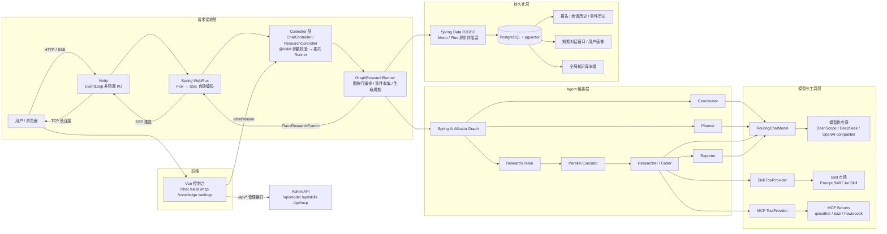
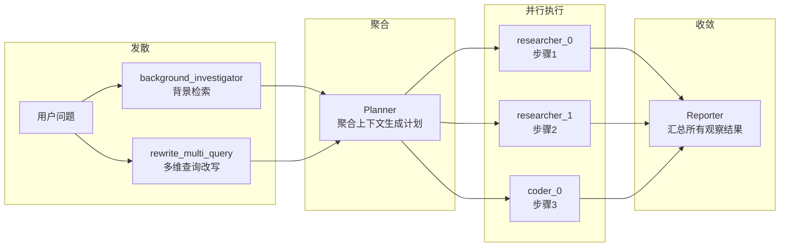

# M-Agent

M-Agent 是一个**完整可用的 DeepResearch 风格 AI Agent 工作流引擎**，集成了多模型供应商切换、WebFlux SSE 流式输出、PostgreSQL 持久化、Skill 市场、MCP 工具接入、RAG 检索增强和研究流程编排等核心能力。

**一句话概括**：输入一个研究问题，M-Agent 自动拆解计划、并行执行多步研究、调用外部工具、汇总报告，全程流式可视。

## 核心特性

| 特性 | 说明 |
|------|------|
| **多模型支持** | DeepSeek、MiniMax、Moonshot、智谱、DashScope，运行时热切换 |
| **深度研究工作流** | Coordinator → Planner → Research Team → Parallel Executor → Reporter 全链路 |
| **SSE 流式推送** | 双通道事件流，毫秒级进度感知 |
| **RAG 检索增强** | pgvector 向量存储，支持全局知识库和会话级文档 |
| **MCP 工具协议** | 标准 MCP 协议接入外部服务（天气、地图、菜谱等） |
| **Skill 插件市场** | Prompt Skill + Jar Skill，运行时热插拔 |
| **用户画像** | LLM 自动提取四维画像，支持手动覆盖 |
| **中断恢复** | 检查点-恢复机制，支持人工介入后从断点续跑 |
| **全链路持久化** | 报告、会话历史、事件、对话消息、用户画像全部入库 |

## 技术栈

- **后端**：Java 17、Spring Boot 3.4.x、WebFlux、R2DBC、Flyway
- **Agent 编排**：Spring AI 1.0.0、Spring AI Alibaba Graph
- **模型**：OpenAI-compatible 协议，支持 DeepSeek / MiniMax / Moonshot / 智谱 / DashScope
- **持久化**：PostgreSQL 17 + pgvector 向量存储
- **前端**：Vue 3、Vite、Pinia、Ant Design Vue
- **容器化**：Docker Compose 一键部署（前端 + 后端 + 数据库 + MCP）

## 架构图

### 整体架构



**请求接收层核心机制**：

| 组件 | 职责 | 关键特性 |
|------|------|---------|
| **Netty** | TCP 连接管理、HTTP 协议解析、SSE 长连接维护 | EventLoop 模型，少量线程处理大量并发连接 |
| **WebFlux** | 请求路由、Flux 订阅调度、SSE 格式自动编码 | 检测 `TEXT_EVENT_STREAM_VALUE` 自动将 Flux 编码为 SSE |
| **Controller** | 参数校验（`@Valid`）、委托 Runner、包装 ServerSentEvent | 无业务逻辑，纯路由层 |
| **GraphResearchRunner** | 图执行编排、事件收集为 Flux、R2DBC 持久化时机控制 | 整条链路返回 `Flux<ResearchEvent>`，WebFlux 自动订阅推送 |
| **R2DBC** | 非阻塞数据库访问，`save()` 返回 `Mono` 不阻塞线程 | 等待数据库响应期间线程可服务其他请求 |

# LLM 大脑

LLM 是整个 Agent 系统的中枢，负责理解用户意图、进行逻辑推理、生成行动计划、解读工具返回结果。M-Agent 通过 `RoutingChatModel` 接入多个模型供应商（DeepSeek、DashScope、MiniMax、Moonshot、智谱），并在此基础上构建了重试与自动降级机制保障可用性。

## 模型调用重试机制

LLM API 是整条链路中最不稳定的环节——限流（429）、服务不可用（503）、网络抖动、响应超时，任何一种都会直接中断研究流程。M-Agent 在 `SpringAiAgentClient` 的 LLM 调用层实现了**指数退避重试**，对调用方完全透明。

**重试策略**：

| 维度 | 设计 |
|------|------|
| **重试范围** | 仅对临时性故障重试：ReadTimeout、429 限流、503 服务不可用、ConnectException |
| **最大重试次数** | 3 次（不含首次请求） |
| **退避算法** | 指数退避 + 随机抖动：`base = 2^attempt × 1s`，`jitter = random(0, base/2)` |
| **不重试的情况** | 4xx 客户端错误、模型输出格式问题（属于业务错误，重试无意义） |

**退避时间线**：

```
第 1 次重试：等待 1.0s ~ 1.5s
第 2 次重试：等待 2.0s ~ 3.0s
第 3 次重试：等待 4.0s ~ 6.0s
```

随机抖动避免多个并发请求同时重试形成惊群效应。重试过程中记录 WARN 级别日志（重试次数、等待时长、异常类型），最终失败才向上抛出异常。整个机制对 `AgentClient` 接口签名零变更，`LlmResearcherAgent`、`LlmPlannerAgent` 等调用方无感知。

## 多模型 Fallback 链

重试机制解决的是同一供应商的临时故障，但当整个供应商不可用时（持续 503、Key 失效、服务下线），需要自动切换到备用模型。M-Agent 通过配置化的 **FallbackChain** 实现多模型自动降级。

**执行流程**：

```
供应商 DeepSeek → 重试 3 次 → 全部失败
  ↓ 自动切换（检查 API Key 可用性）
供应商 DashScope → 重试 3 次 → 成功 → 返回结果
```

**设计要点**：

| 维度 | 设计 |
|------|------|
| **切换条件** | 当前供应商重试全部耗尽后触发，429 限流优先等待而非立即切换 |
| **Key 检查** | 切换前校验目标供应商的 API Key 是否存在，跳过无 Key 的供应商 |
| **执行顺序** | 按 `priority` 升序，最低值为首选供应商 |
| **最大总耗时** | 与任务总超时配合（2-5 分钟），避免无限重试切换 |
| **日志** | 切换时记录 INFO 日志：原始供应商、切换原因、目标供应商 |
| **前端感知** | `/api/model/current` 接口暴露 `fallbackStatus` 字段，前端可提示"当前使用备用模型" |

整个机制在 `SpringAiAgentClient` 内部实现，`RoutingChatModel` 接口不变，对所有 Agent 调用方透明。降级确实会带来质量下降，但"质量稍差的回答"远好过"完全不可用"。

## 语义缓存

传统缓存按字符串精确匹配，但用户的同一意图可以有无数种表述方式。M-Agent 基于 Spring AI 的 `SemanticCache` 抽象实现**语义级缓存**——将用户查询转化为向量，通过余弦相似度匹配历史命中，相似度超过阈值直接返回缓存结果，跳过 LLM 调用。

**工作原理**：

```
用户: "北京今天天气怎么样"
  → Embedding → 向量 → pgvector 存储 → LLM 调用 → 缓存响应

用户: "查一下首都的天气"  （语义相似，表述不同）
  → Embedding → 向量 → pgvector 相似度检索 → 命中 0.92 > 阈值 0.85
  → 直接返回缓存响应，跳过 LLM 调用
```

**核心架构**：

Spring AI 自身不造存储轮子，而是定义了高度抽象的 `VectorStore` 接口。`SemanticCacheAdvisor` 构建时传入哪个 `VectorStore` 实现，数据就存哪个库里。这些向量数据库天生具备"双重能力"：

- **存向量 + 算相似度**：处理 Key（问题向量）
- **存 JSON / Metadata**：处理 Value（序列化后的 `ChatResponse`）

Key（向量）和 Value（序列化对象）打包在同一条记录里，一石双鸟。

**底层存储结构**（以 pgvector 为例）：

| 字段 | 内容 | 说明 |
|------|------|------|
| `embedding` | `[0.123, -0.456, 0.789, ...]` | 问题向量，pgvector 基此建立 ANN 索引 |
| `content` | `"Java怎么学?"` | 原始问题文本 |
| `metadata` | `{"result": {...}, "usage": {...}}` | 序列化的 ChatResponse，含模型输出和 token 用量 |

**实现层**：

| 组件 | 说明 |
|------|------|
| `VectorStore` 接口 | Spring AI 标准抽象，解耦存储层，可切换 pgvector / Redis / Milvus |
| `PgVectorStore` 实现 | 复用项目已有的 pgvector + DashScope Embedding，无需引入额外基础设施 |
| `SemanticCacheAdvisor` | ChatClient Advisor，拦截 LLM 调用：先查缓存 → 命中则返回 → 未命中则调用 LLM 并写入缓存 |
| 相似度阈值 | 可配置（默认 0.95），过高导致漏缓存，过低导致误命中 |
| TTL 过期 | 缓存条目支持时效过期，避免返回过时结果 |

```java
@Bean
public SemanticCacheAdvisor semanticCacheAdvisor(VectorStore vectorStore, EmbeddingModel embeddingModel) {
    return SemanticCacheAdvisor.builder(vectorStore, embeddingModel)
            .similarityThreshold(0.95)
            .build();
}
```

语义缓存对研究流程中的高频相似问题效果显著——同一会话内追问"再说详细点"、"换个角度分析"等变体表述可以直接命中缓存，节省大量 token 消耗和响应延迟。

# 规划模块

规划模块负责将用户问题拆解为可执行的研究计划，并管理工作流的执行生命周期与中断恢复。M-Agent 的规划策略融合了 ReAct 控制范式和 GoT 图推理结构，分别解决"怎么执行"和"怎么推理"两个层面的问题。

## ReAct

M-Agent 中**每个工作流节点都是一个独立的 ReAct 循环**。ReAct（Reasoning + Acting）的核心思想是：想一步、做一步、看一步，推理指导行动，行动反馈推理，二者交替螺旋式推进直到任务完成。

ReAct 的三元组 `Thought → Action → Observation` 在每个节点内部自闭环：

| 节点 | Thought | Action | Observation |
|------|---------|--------|-------------|
| **Coordinator** | 分析问题复杂度，判断走快速回答还是深度研究 | 输出路由决策 JSON | 下游节点执行结果 |
| **Planner** | 综合背景搜索、用户画像等上下文，拆解研究步骤 | 输出结构化研究计划 JSON | Plan Validator 校验结果 |
| **Researcher** | 分析当前步骤需要什么信息，决定调用哪个工具 | 调用 MCP / Skill 工具 | 工具返回的真实数据 |
| **Coder** | 整合已有观察结果，决定如何加工和格式化 | 调用工具或直接推理 | 处理后的结构化输出 |
| **Reporter** | 汇总所有观察结果，规划报告结构 | 生成最终 Markdown 报告 | 报告持久化结果 |

**单节点内部的 ReAct 循环示例**（ResearcherNode 执行"生辰八字查询"步骤）：

```
Thought: 用户问生辰八字，需要精确的干支计算，我应该调用 Bazi MCP 工具
Action:  调用 bazi 工具，参数 {"date": "2007-01-11"}
Observation: 工具返回丙戌年、辛丑月、乙巳日及五行分析
Thought: 已获取准确的四柱信息，可以输出结论了
Action:  Finish，输出观察结果
```

每个节点内部的 Thought → Action → Observation 通过 Spring AI 的 function calling 机制自动驱动——LLM 推理决定调用哪个工具，系统执行工具并将结果注入上下文，LLM 继续推理，直到判断任务完成。整个过程通过 SSE 事件流实时推送到前端。

## GoT

在 Planner 生成研究计划时，M-Agent 采用 **GoT（Graph-of-Thought）** 图推理结构，突破 CoT 线性链路的局限。

CoT 是一条线、ToT 是一棵树、GoT 是一张图。GoT 最关键的新增能力是**思维聚合（Aggregation）**——允许多个分支的中间结论汇总合并成新结论，形成 DAG 甚至包含环路的图结构。这种"先发散再收敛"的模式在树结构中做不到。

M-Agent 的研究计划本质上是一张有向图：



| GoT 特性 | M-Agent 对应 |
|---------|-------------|
| **发散** | `rewrite_multi_query` 生成多个优化查询，`background_investigator` 并行搜索 |
| **聚合** | Planner 将多源上下文（背景搜索、用户画像、对话历史）聚合成结构化研究计划 |
| **并行执行** | `Parallel Executor` 将计划步骤分发给多个 researcher / coder 并行执行 |
| **收敛** | Reporter 汇总所有步骤的观察结果，生成最终报告 |

这种图结构让 M-Agent 能够处理需要"先分后合"的复杂研究任务——例如分析多个竞品时，各竞品独立研究（发散），最后汇总对比（收敛）。

## 中断恢复

实现 **有状态工作流的检查点-恢复（Checkpoint-Resume）机制**，让长时运行的深度研究任务在人工介入或异常中断后从精确断点续跑，而非全量重启。

系统支持两个语义化暂停锚点：

| 暂停点 | 触发条件 | 用户操作 |
|--------|---------|---------|
| 计划确认 | Plan Validator 完成校验，路由至 `HUMAN_FEEDBACK` | 接受计划 / 提出修改意见 / 拒绝 |
| 人工反馈 | 工作流中显式等待用户决策 | 注入反馈内容并决定后续路由 |

整个生命周期由 `research_session_histories` 表追踪完整状态机：`RUNNING → PAUSED → RUNNING → COMPLETED / STOPPED / FAILED`。

# 记忆模块

记忆模块让 Agent 从"一次性问答"进化为"渐进式理解"，包含短期记忆（会话内上下文）和长期记忆（跨会话语义检索）两个层次。

## 短期记忆

采用**会话级滑动窗口**策略，以极简实现精准保留最近相关上下文，保证多轮交互的语义连贯性。

同一 `session_id` 下最近的对话消息按时间排序注入 Coordinator、Planner 和 Reporter 的 prompt，帮助 LLM 理解追问意图与上下文关联。每条消息硬截断至 800 字符、窗口上限 20 条，将 Token 消耗与计算延迟严格控制在常数级，从机制上杜绝模型上下文溢出。消息写入采用异步降级策略（`.onErrorResume`），持久化失败静默丢弃，不阻塞主研究流程。

prompt 中内嵌护栏指令——"Use this only to adapt explanation depth and style. Do not infer facts not present in research evidence"——强制 LLM 将对话历史限定为风格参考而非事实来源，防止记忆污染与幻觉传播。

## 长期记忆

采用 **Embedding 向量检索** 实现语义级长期记忆，将记忆的"存"和"取"统一为向量空间中的操作。

**核心流程**：

1. **存**：对话历史摘要、用户画像、领域文档等长期信息通过 Embedding 模型（DashScope `text-embedding-v1`）转化为向量，写入 pgvector 向量表
2. **取**：Planner 编写研究计划时，将当前问题同样转化为向量，在向量库中做余弦相似度检索，找出语义最相关的记忆片段注入上下文供 LLM 参考

语义检索的优势在于：即使用户的问法与存储时的原文表述不同，只要语义相近就能命中。例如存储了"Java 并发编程最佳实践"，用户问"多线程有哪些注意事项"依然可以检索到。

**用户画像引擎**：

`UserProfileService` 从对话流中自动提炼四维结构化画像：`profile_summary`（身份摘要）、`expertise_level`（专业水平）、`detail_preference`（详略偏好）、`style_preference`（内容风格）。提取结果经 Set 白名单校验后落入 `user_profiles` 表——非法枚举值静默忽略，LLM 解析失败不抛异常，保证画像管线鲁棒可降级。

缓存策略采用 TTL 惰性刷新：60 分钟内直接命中缓存，避免冗余 LLM 调用；超时后取最近 10 条消息做增量更新，新旧画像合并而非全量重建。画像同步注入 Coordinator（辅助判断问题复杂度与路由决策）和 Reporter（自适应调节报告深度与行文风格），注入格式附带与短期记忆同源的护栏约束。

**用户画像支持手动覆盖**：前端知识库页面提供可视化编辑，手动修改的字段不被自动提取覆盖，实现"系统自动 + 人工精调"的混合画像策略。

# 工具使用

工具扩展了 LLM 的能力边界，让 Agent 能处理超出预训练知识的实时数据。M-Agent 通过插件化 Skill、MCP 协议和 RAG 管线三层工具体系，实现能力的热插拔与语义级发现。

## 插件化 Skill

设计 **可热插拔的 Skill 插件架构**，将工具能力从 Agent 核心逻辑中解耦，实现"能力即插件、插件即市场"的开放式工具生态。

两类 Skill 统一通过 `SkillToolProvider` 注册为 LLM 的 function calling 工具集：

| 类型 | 组成 | 定位 |
|------|------|------|
| Prompt Skill | `skill.json` + `SKILL.md` | 零代码模板化技能，适合规则明确的任务指令 |
| Jar Skill | `skill.json` + `plugin.jar` | 全能力 Java 插件，通过 `SkillPlugin` SPI + ServiceLoader 接入 |

核心机制：
- **运行时热切换**：`PATCH /api/skills/{name}/toggle` 毫秒级启停，无需重启 JVM
- **ClassLoader 级隔离**：`SkillPluginClassLoader` 为每个 Jar Skill 创建独立类加载器
- **声明式健康探针**：`GET /api/skills/{name}/health` 在注册前验证插件可用性

## MCP

接入 **Model Context Protocol（MCP）标准协议**，以统一的工具描述语言打通异构外部服务，让 LLM 在单一协议层面对多源工具进行语义级发现与调用。

支持 SSE 和 Streamable HTTP 两种传输协议，支持自定义 Headers 和 API Key 认证，可直接接入 ModelScope 等 MCP 服务市场。

核心机制：
- **启动时自动发现**：连接 MCP Server → 拉取 `tools/list` → 注册到全局工具注册表
- **运行时热重载**：`POST /api/mcp/reload` 在不下线服务的前提下刷新工具清单
- **声明式配置**：`mcp-config.json` 集中管理所有 MCP Server 的连接参数与启停状态

## RAG

构建 **检索增强生成（RAG）管线**，将外部知识检索作为图工作流的一等公民节点嵌入，在 LLM 推理之前注入语义相关的外部证据。

**全局知识库**：用户在前端知识库页面上传的文档对所有会话生效，支持文档列表查看和删除。`RagRetriever` 自动合并全局文档和会话级文档的检索结果。

两个可选 RAG 节点覆盖双重检索场景：

| 节点 | 触发条件 | 检索目标 |
|------|---------|---------|
| `USER_FILE_RAG` | `rag.enabled=true` 且用户上传文件 | 用户私有文档 + 全局知识库语义检索 |
| `PROFESSIONAL_KB_RAG` | 用户选定专业知识库 | 领域知识库定向检索 |

## 向量数据库

在 PostgreSQL 上启用 **pgvector 扩展**，将向量存储与关系型业务数据置于同一数据库引擎内，以零额外基础设施实现高维语义嵌入的存储与近似最近邻（ANN）检索。

Spring AI 的 `PgVectorStore` 提供开箱即用的向量写入与余弦相似度查询。嵌入向量由 DashScope 统一生成——用户上传文档经 Tika 解析 → 分块 → 向量化 → 写入 pgvector，形成完整的非结构化数据到结构化语义索引的转换链路。

# 快速开始（Docker 一键部署）

### 前置条件

- Docker Desktop 已安装并启动
- 已配置模型供应商 API Key

### 1. 配置 API Key

编辑 `.local/model-providers.json`，填入你的 API Key：

```json
{
  "deepseek": "sk-你的DeepSeek-Key",
  "minimax": "sk-api-你的MiniMax-Key",
  "dashscope": "sk-你的DashScope-Key"
}
```

编辑 `.local/mcp-keys.json`，配置 MCP 服务 Key：

```json
{
  "QWEATHER_API_KEY": "你的和风天气Key",
  "AMAP_MAPS_API_KEY": "你的高德地图Key"
}
```

### 2. 一键启动

```bash
docker compose up -d
```

### 3. 访问应用

| 服务 | 地址 |
|------|------|
| 前端 | http://localhost |
| 后端 API | http://localhost:8080 |
| 和风天气 MCP | http://localhost:18090 |

### 4. 查看日志

```bash
# 查看后端日志
docker compose logs -f backend

# 查看所有服务日志
docker compose logs -f
```

### 5. 停止服务

```bash
docker compose down
```

