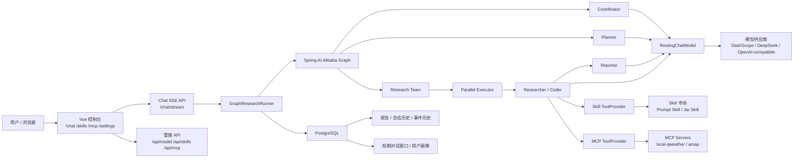
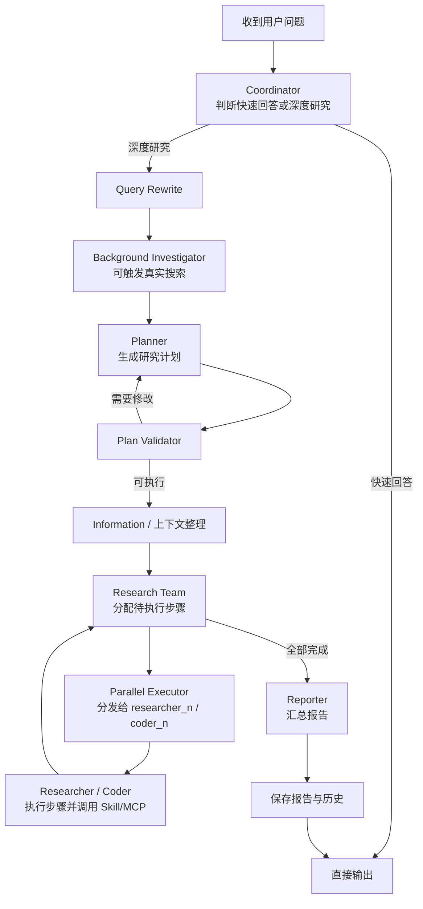
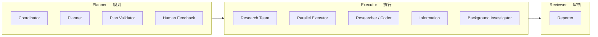

# M-Agent

M-Agent 以 DeepResearch 风格的工作流为核心，展示模型供应商切换、WebFlux SSE 流式输出、PostgreSQL 持久化、Skill 市场、MCP 工具接入和研究流程编排。


## 技术栈

- 后端：Java 17、Spring Boot 3.4.x、Maven、WebFlux、R2DBC、Flyway
- Agent 编排：Spring AI、Spring AI Alibaba Graph
- 模型：DashScope 与 OpenAI-compatible provider，例如 DeepSeek、MiniMax、Moonshot、智谱等
- 持久化：PostgreSQL，包含报告、会话历史、事件历史、对话消息、用户画像
- 工具与扩展：Skill 市场、本地 Jar Skill 插件接口、MCP Client
- 前端：Vue 3、Vite、Pinia、Ant Design Vue
- 本地 MCP 示例：`tools/local-qweather-mcp`，提供 `weather_now` 实时天气工具


## 架构图



## Agent 工作流



后续 Agent Team 高分 Demo 将在此基础上补齐"活动策划"场景，把 Planner / Executor / Reviewer 的角色、任务分发和状态流展示得更清晰。

## Agent Team 协作

研究工作流中的节点按角色分为三类，前端时间线按角色分组展示：



角色映射：

| 角色 | 包含节点 | 职责 |
|------|---------|------|
| Planner | coordinator、planner、plan_validator、human_feedback | 理解需求、制定计划、确认计划 |
| Executor | research_team、parallel_executor、researcher_N、coder_N、information、background_investigator | 分配任务、执行步骤、调用 Skill/MCP |
| Reviewer | reporter | 汇总报告、检查遗漏 |

SSE 事件中的 `agent_role` 字段标识每个事件所属角色。前端时间线按角色分组、颜色区分：Planner（紫色）、Executor（蓝色）、Reviewer（绿色）。

活动策划 Demo 示例：

```powershell
'{"query":"帮我策划一个周六下午在上海适合 20 人的技术读书会活动，考虑天气、场地、流程和风险。","session_id":"team-demo","enable_deepresearch":true,"auto_accepted_plan":true}' | Set-Content -Encoding UTF8 target/http-check/team-demo.json
curl.exe -N -H "Content-Type: application/json" --data-binary "@target/http-check/team-demo.json" http://localhost:18080/chat/stream > target/http-check/team-demo.sse
```

## 短期记忆

采用**会话级滑动窗口**策略，以极简实现精准保留最近相关上下文，保证多轮交互的语义连贯性。

同一 `session_id` 下最近的对话消息按时间排序注入 Coordinator、Planner 和 Reporter 的 prompt，帮助 LLM 理解追问意图与上下文关联。每条消息硬截断至 800 字符、窗口上限 20 条，将 Token 消耗与计算延迟严格控制在常数级，从机制上杜绝模型上下文溢出。消息写入采用异步降级策略（`.onErrorResume`），持久化失败静默丢弃，不阻塞主研究流程。

prompt 中内嵌护栏指令——"Use this only to adapt explanation depth and style. Do not infer facts not present in research evidence"——强制 LLM 将对话历史限定为风格参考而非事实来源，防止记忆污染与幻觉传播。

## 长期记忆

构建 **LLM 驱动的结构化用户画像引擎**，从对话流中自动提炼跨会话的用户特征，实现从"一次性问答"到"渐进式理解"的体验跃迁。

`UserProfileService` 定期从最近消息中提取四维结构化画像：`profile_summary`（身份摘要）、`expertise_level`（专业水平）、`detail_preference`（详略偏好）、`style_preference`（内容风格）。提取结果经 Set 白名单校验后落入 `user_profiles` 表——非法枚举值静默忽略，LLM 解析失败不抛异常，保证画像管线鲁棒可降级。

缓存策略采用 TTL 惰性刷新：60 分钟内直接命中缓存，避免冗余 LLM 调用；超时后取最近 10 条消息做增量更新，新旧画像合并而非全量重建。画像同步注入 Coordinator（辅助判断问题复杂度与路由决策）和 Reporter（自适应调节报告深度与行文风格），注入格式附带与短期记忆同源的护栏约束。

**跨线程背景记忆**作为长期记忆的补充维度：`SessionContextService` 在 Planner 执行前拉取同一 `session_id` 下近期已完成的研究报告摘要（排除当前线程，上限 5 篇，单篇截断至 1200 字符），以结构化上下文形式注入计划制定阶段，消除跨研究的信息孤岛。

## 插件化 Skill

设计 **可热插拔的 Skill 插件架构**，将工具能力从 Agent 核心逻辑中解耦，实现"能力即插件、插件即市场"的开放式工具生态。

两类 Skill 统一通过 `SkillToolProvider` 注册为 LLM 的 function calling 工具集：

| 类型 | 组成 | 定位 |
|------|------|------|
| Prompt Skill | `skill.json` + `SKILL.md` | 零代码模板化技能，适合规则明确的任务指令 |
| Jar Skill | `skill.json` + `plugin.jar` | 全能力 Java 插件，通过 `SkillPlugin` SPI + ServiceLoader 接入 |

核心机制：
- **运行时热切换**：`PATCH /api/skills/{name}/toggle` 毫秒级启停，无需重启 JVM 或中断正在执行的研究流
- **ClassLoader 级隔离**：`SkillPluginClassLoader` 为每个 Jar Skill 创建独立类加载器，实现依赖隔离与生命周期自治，卸载时彻底回收元空间
- **声明式健康探针**：`GET /api/skills/{name}/health` 在注册前验证插件可用性，阻断异常插件污染工具注册表
- **安全边界**：Jar Skill 默认关闭，需显式传递 `--mvp.skill.jar-plugins.enabled=true` 启用，适用本地可信插件场景

## MCP

接入 **Model Context Protocol（MCP）标准协议**，以统一的工具描述语言打通异构外部服务，让 LLM 在单一协议层面对多源工具进行语义级发现与调用。

基于 Spring AI MCP Client WebFlux 实现 SSE 传输层，`McpToolProvider` 将 MCP Server 暴露的所有工具自动转译为 LLM function calling schema：

```json
{
  "servers": {
    "mcp-qweather": { "type": "sse", "url": "http://127.0.0.1:18090/sse", "enabled": true },
    "mcp-amap": { "type": "sse", "url": "...", "enabled": false }
  }
}
```

核心机制：
- **启动时自动发现**：连接 MCP Server → 拉取 `tools/list` → 注册到全局工具注册表，全程零人工编排
- **运行时热重载**：`POST /api/mcp/reload` 在不下线服务的前提下刷新工具清单，适配 MCP Server 的滚动升级
- **声明式配置**：`mcp-config.json` 集中管理所有 MCP Server 的连接参数与启停状态，`McpStatusController` 实时暴露健康状态

MCP 工具在 Researcher/Coder 节点执行期间对 LLM 可见，模型自主决策调用时机与参数组合，无需硬编码调用逻辑。

## Spring Data R2DBC

全面采用 **响应式数据访问层**，基于 Spring Data R2DBC + `r2dbc-postgresql` 驱动，实现从 HTTP 入口到数据库出口的全链路非阻塞 I/O。

| Repository | 对应表 | 响应式语义 |
|-----------|--------|-----------|
| `ConversationMessageRepository` | `conversation_messages` | `Mono<T>` / `Flux<T>` |
| `UserProfileRepository` | `user_profiles` | `Mono<T>` / `Flux<T>` |
| `ResearchSessionHistoryRepository` | `research_session_histories` | `Mono<T>` / `Flux<T>` |
| `ResearchReportRepository` | `research_reports` | `Mono<T>` / `Flux<T>` |
| `ResearchEventHistoryRepository` | `research_events` | `Mono<T>` / `Flux<T>` |

所有 Repository 方法返回响应式类型，与 WebFlux 的 Netty 事件循环天然集成——数据库 I/O 不再阻塞服务线程，连接池资源利用率与吞吐量获得数量级提升。Schema 演进由 Flyway 管理 8 个版本迁移脚本保障，可追溯、可回滚。测试环境切换至 `r2dbc-h2` 内存数据库，零外部依赖即可全量运行集成测试。

## Spring WebFlux (SSE)

基于 **Spring WebFlux 响应式运行时**构建服务层，核心差异化能力在于 **SSE（Server-Sent Events）流式推送**——将深度研究这一长时运行任务从"请求-等待-响应"的阻塞模型，重构为"订阅-流式消费"的事件驱动模型。

关键端点矩阵：

| 端点 | 媒体类型 | 职责 |
|------|---------|------|
| `/chat/stream` | `text/event-stream` | 研究过程实时推送 |
| `/api/research/stream` | `text/event-stream` | 直接触发研究流 |
| `/api/conversations` | `application/json` | 会话列表查询 |
| `/api/sessions/{id}/threads/{id}/events` | `application/json` | 历史事件回放 |

Runner 内部实现**双通道事件流架构**：Live Channel 在节点执行期间通过 `doOnNext` → `Sinks.Many` 热流实时推送进度事件，前端在毫秒级延迟内感知节点状态变化；Completion Channel 在所有节点完成后统一发出 done 事件与报告全文，确保终端信号与中间进度严格解耦。双通道共享去重集合，保证 exactly-once 语义。

图执行通过 `subscribeOn(Schedulers.boundedElastic())` 隔离到弹性线程池，Netty I/O 线程永不阻塞，背压由 Reactor 内核自动传导。

## RAG

构建 **检索增强生成（RAG）管线**，将外部知识检索作为图工作流的一等公民节点嵌入，在 LLM 推理之前注入语义相关的外部证据，从根本上缓解幻觉与知识截止问题。

两个可选 RAG 节点覆盖双重检索场景：

| 节点 | 触发条件 | 检索目标 |
|------|---------|---------|
| `USER_FILE_RAG` | `rag.enabled=true` 且用户上传文件 | 用户私有文档语义检索 |
| `PROFESSIONAL_KB_RAG` | 用户选定专业知识库 | 领域知识库定向检索 |

`RagRetriever` 封装向量相似度搜索，`VectorStoreDataIngestionService` 通过 Apache Tika 解析多格式文档并批量写入向量存储。RAG 节点精准插入 Query Rewrite 之后、Background Investigator 之前——确保检索增强的上下文同时影响计划制定与后续深度搜索，而非仅在报告生成阶段做表面拼接。

`rag.enabled` 全局开关控制管线启停，关闭时对应节点从图中完全移除，零开销。

## 向量数据库

在 PostgreSQL 上启用 **pgvector 扩展**，将向量存储与关系型业务数据置于同一数据库引擎内，以零额外基础设施实现高维语义嵌入的存储与近似最近邻（ANN）检索。

```sql
CREATE EXTENSION IF NOT EXISTS vector;
```

Spring AI 的 `PgVectorStore` 提供开箱即用的向量写入与余弦相似度查询。嵌入向量由 `DashScopeEmbeddingConfiguration` 统一生成——用户上传文档经 Tika 解析 → 分块 → 向量化 → 写入 pgvector，形成完整的非结构化数据到结构化语义索引的转换链路。

pgvector 的架构选择考量：MVP 阶段避免引入独立的向量数据库集群，将语义检索与业务数据的 ACID 保障统一在 PostgreSQL 的事务边界内；数据规模增长后可平滑升级至 IVFFlat / HNSW 近似索引，召回性能与百万级向量规模是线性可扩展的。

## 中断恢复

实现 **有状态工作流的检查点-恢复（Checkpoint-Resume）机制**，让长时运行的深度研究任务在人工介入或异常中断后从精确断点续跑，而非全量重启。

系统支持两个语义化暂停锚点：

| 暂停点 | 触发条件 | 用户操作 |
|--------|---------|---------|
| 计划确认 | Plan Validator 完成校验，路由至 `HUMAN_FEEDBACK` | 接受计划 / 提出修改意见 / 拒绝 |
| 人工反馈 | 工作流中显式等待用户决策 | 注入反馈内容并决定后续路由 |

暂停时 Runner 对当前图状态执行**深拷贝快照**，存入 `ConcurrentHashMap<String, Map>` 内存检查点。恢复时从检查点精确还原状态图，注入用户决策，切换至 `resumeGraph` 继续执行——恢复图的入口为 `START → HUMAN_FEEDBACK`，按决策内容分流至 Planner（带修改意见重新规划）、Information（接受计划继续执行）或 END（用户拒绝终止）。

整个生命周期由 `research_session_histories` 表追踪完整状态机：`RUNNING → PAUSED → RUNNING → COMPLETED / STOPPED / FAILED`。用户刷新页面后通过 `/api/sessions/{sessionId}/history` 恢复会话全貌，前端据此重建 UI 状态。

## 本地启动

### 1. 启动 PostgreSQL

先确认 Docker Desktop 已启动，然后在仓库根目录执行：

```powershell
docker compose up -d postgres
docker ps --format "{{.Names}}\t{{.Status}}\t{{.Ports}}"
```

期望看到 `manmu-postgres` 为 `healthy`，并映射 `5432`。

### 2. 配置模型 Key

不要把 Key 写入源码或提交记录。推荐通过控制台或接口保存：

```powershell
curl.exe -X POST http://localhost:18080/api/model/providers/deepseek/key `
  -H "Content-Type: application/json" `
  --data-binary "{\"apiKey\":\"你的 Key\"}"
```

本地敏感配置位于 `.local/`，该目录已被 `.gitignore` 忽略。

### 3. 启动本地和风天气 MCP

如需演示 `weather-now` Skill 或 `weather_now` MCP 工具，先配置和风天气 Key：

```powershell
New-Item -ItemType Directory -Force .local | Out-Null
'{"QWEATHER_API_KEY":"你的和风天气 Key"}' | Set-Content -Encoding UTF8 .local/mcp-keys.json
```

启动 MCP Server：

```powershell
cd tools/local-qweather-mcp
npm install
npm run build
npm start
```

默认监听 `http://127.0.0.1:18090/sse`。

### 4. 启动后端

```powershell
$env:JAVA_HOME='C:\WorkResources\JDKs\JDK17'
$env:PATH="$env:JAVA_HOME\bin;$env:PATH"
mvn spring-boot:run "-Dspring-boot.run.arguments=--server.port=18080"
```

Jar Skill 默认关闭。仅在本地可信演示时临时启用：

```powershell
mvn spring-boot:run "-Dspring-boot.run.arguments=--server.port=18080 --mvp.skill.jar-plugins.enabled=true"
```

### 5. 启动前端

```powershell
cd ui-vue3
npm install
npm run dev
```

常用页面：

- `http://localhost:5173/chat`
- `http://localhost:5173/skills`
- `http://localhost:5173/mcp`
- `http://localhost:5173/settings`

## 常用验证

> 各特性的详细说明见上文对应章节：[短期记忆](#短期记忆)、[长期记忆](#长期记忆)、[插件化 Skill](#插件化-skill)、[MCP](#mcp)、[RAG](#rag)、[中断恢复](#中断恢复)。以下为快速验证命令。

### 短期记忆与长期记忆

```powershell
New-Item -ItemType Directory -Force target/http-check | Out-Null
'{"query":"我偏好简洁中文回答，请记住。","session_id":"memory-demo","enable_deepresearch":false}' | Set-Content -Encoding UTF8 target/http-check/memory-1.json
curl.exe -N -H "Content-Type: application/json" --data-binary "@target/http-check/memory-1.json" http://localhost:18080/chat/stream > target/http-check/memory-1.sse

'{"query":"刚才我说我偏好什么风格？","session_id":"memory-demo","enable_deepresearch":false}' | Set-Content -Encoding UTF8 target/http-check/memory-2.json
curl.exe -N -H "Content-Type: application/json" --data-binary "@target/http-check/memory-2.json" http://localhost:18080/chat/stream > target/http-check/memory-2.sse

curl.exe http://localhost:18080/api/conversations/memory-demo > target/http-check/memory-conversation.json
```

### 能力开关

```powershell
curl.exe http://localhost:18080/api/app/capabilities
```

### 模型供应商与切换

```powershell
curl.exe http://localhost:18080/api/model/providers
curl.exe http://localhost:18080/api/model/current
'{"providerId":"deepseek","modelName":"deepseek-chat"}' | Set-Content -Encoding UTF8 target/http-check/model-switch.json
curl.exe -X POST -H "Content-Type: application/json" --data-binary "@target/http-check/model-switch.json" http://localhost:18080/api/model/switch
```

### Skill 市场

```powershell
curl.exe http://localhost:18080/api/skills
curl.exe http://localhost:18080/api/skills/weather-now/health
curl.exe http://localhost:18080/api/skills/calculator/health
curl.exe http://localhost:18080/api/skills/web-search/health
curl.exe -X PATCH http://localhost:18080/api/skills/weather-now/toggle
curl.exe -X PATCH http://localhost:18080/api/skills/weather-now/toggle
```

### MCP 状态和天气工具

```powershell
curl.exe http://localhost:18080/api/mcp/status
curl.exe http://localhost:18080/api/mcp/servers
curl.exe -X POST http://localhost:18080/api/mcp/servers/mcp-qweather/test
curl.exe -X POST http://localhost:18080/api/mcp/reload
'{"location":"上海"}' | Set-Content -Encoding UTF8 target/http-check/weather-now-request.json
curl.exe -X POST -H "Content-Type: application/json" --data-binary "@target/http-check/weather-now-request.json" http://localhost:18080/api/mcp/tools/weather_now/invoke
```

### Jar Skill 热加载演示

Jar Skill 默认关闭。控制台 `/skills` 会展示 Jar 插件开关状态；默认关闭时上传 Jar 包会返回 `Jar Skill plugins are disabled`。生成演示包：

```powershell
$env:JAVA_HOME='C:\WorkResources\JDKs\JDK17'
$env:PATH="$env:JAVA_HOME\bin;$env:PATH"
mvn '-Dtest=JarSkillDemoPackageGeneratorTest' '-Dmvp.demo.jar-skill-package=true' test
```

启用可信本地 Jar 插件后启动后端，再验证导入、健康、重载、启停和卸载：

```powershell
mvn spring-boot:run "-Dspring-boot.run.arguments=--server.port=18080 --mvp.skill.jar-plugins.enabled=true"
curl.exe -F "file=@target/demo-packages/echo-json-skill.zip" http://localhost:18080/api/skills/packages/import-jar > target/http-check/jar-import.json
curl.exe http://localhost:18080/api/skills/echo-json-skill > target/http-check/jar-detail.json
curl.exe http://localhost:18080/api/skills/echo-json-skill/health > target/http-check/jar-health.json
curl.exe -X POST http://localhost:18080/api/skills/echo-json-skill/reload > target/http-check/jar-reload.json
curl.exe -X PATCH http://localhost:18080/api/skills/echo-json-skill/toggle > target/http-check/jar-toggle-off.json
curl.exe -X PATCH http://localhost:18080/api/skills/echo-json-skill/toggle > target/http-check/jar-toggle-on.json
curl.exe -X DELETE http://localhost:18080/api/skills/packages/echo-json-skill
```

### 聊天 SSE

```powershell
New-Item -ItemType Directory -Force target/http-check | Out-Null
'{"query":"@weather-now 查询上海实时天气","session_id":"demo-session","enable_deepresearch":false}' | Set-Content -Encoding UTF8 target/http-check/chat-weather.json
curl.exe -N -H "Content-Type: application/json" --data-binary "@target/http-check/chat-weather.json" http://localhost:18080/chat/stream > target/http-check/chat-weather.sse

'{"query":"@calculator 计算 (128 + 256) * 3 / 6","session_id":"demo-session","enable_deepresearch":false}' | Set-Content -Encoding UTF8 target/http-check/chat-calculator.json
curl.exe -N -H "Content-Type: application/json" --data-binary "@target/http-check/chat-calculator.json" http://localhost:18080/chat/stream > target/http-check/chat-calculator.sse

'{"query":"@web-search 搜索并总结 Spring Boot 3 WebFlux SSE 的关键注意事项","session_id":"demo-session","enable_deepresearch":true,"auto_accepted_plan":true}' | Set-Content -Encoding UTF8 target/http-check/chat-web-search.json
curl.exe -N -H "Content-Type: application/json" --data-binary "@target/http-check/chat-web-search.json" http://localhost:18080/chat/stream > target/http-check/chat-web-search.sse
```

### 深度研究 SSE 与持久化

```powershell
'{"query":"解释为什么 Agent 工作流要区分 Planner、Researcher 和 Reporter。","session_id":"research-demo","enable_deepresearch":true,"auto_accepted_plan":true}' | Set-Content -Encoding UTF8 target/http-check/research.json
curl.exe -N -H "Content-Type: application/json" --data-binary "@target/http-check/research.json" http://localhost:18080/chat/stream > target/http-check/research.sse
curl.exe http://localhost:18080/api/sessions/research-demo/history > target/http-check/research-history.json
curl.exe http://localhost:18080/api/reports/session/research-demo > target/http-check/research-reports.json
```

## 测试

后端：

```powershell
$env:JAVA_HOME='C:\WorkResources\JDKs\JDK17'
$env:PATH="$env:JAVA_HOME\bin;$env:PATH"
mvn test
```

前端：

```powershell
cd ui-vue3
npm run test:unit
npm run build
```

本地 MCP：

```powershell
cd tools/local-qweather-mcp
npm test
npm run build
```

## Skill 开发

详见 [Skill 开发指南](docs/skill-development-guide.md)。

当前支持两类 Skill：

- Prompt Skill：`skill.json + SKILL.md`，适合模板化任务说明。
- Jar Skill：`skill.json + plugin.jar`，通过 `SkillPlugin` 和 `ServiceLoader` 接入，默认关闭，仅用于本地可信插件。

Jar Skill 不是安全沙箱。它通过独立 `SkillPluginClassLoader` 做依赖和生命周期隔离，但仍然只能上传自己编译、可审计、可信的本地 Jar 包。

## MCP 配置

详见 [MCP 工具配置](docs/mcp-tools.md)。

内置配置位于 `src/main/resources/mcp-config.json`：

- 高德 MCP：ID 为 `mcp-amap`，默认关闭，需要 `AMAP_MAPS_API_KEY`。
- 本地和风天气 MCP：ID 为 `mcp-qweather`，默认启用，连接 `http://127.0.0.1:18090/sse`，需要启动 `tools/local-qweather-mcp`。

## Demo 录制

详见 [Demo 脚本](docs/demo-script.md)。建议录制以下路径：

1. 模型供应商查看和切换。
2. Skill 市场查看、健康检查、启停和显式调用。
3. MCP 页面连接测试和 `weather_now` 调试。
4. 深度研究 SSE 过程、报告与会话历史持久化。
5. Agent Team 活动策划流程，观察角色分组时间线。

## 安全与提交约束

- 不提交 `.local/`、`target/`、`.idea/`、`.claude/`。
- 不在源码、测试断言、README 示例输出或提交记录中写入 API Key。
- Jar Skill 不是安全沙箱。ClassLoader 隔离只用于本地可信插件的依赖和生命周期隔离。
- 真实 HTTP/SSE 验证后必须关闭后端服务，并确认 `18080` 端口释放。


我给你描述一下刚才测试的过程:

1. 我提问你好, 接着直接出现气泡回复, 这点很好

2. 接着我上传了一个简单的文档, 里面只有"我非常喜欢吃拉面" 这几个字, 然后询问"今天中午吃什么好呢", 意在测试mcp和RAG, 结果返回了正常的回复而不是JSON字符串, 这点值得表扬, 但是显然没有用上我上传的文件

3. 我接着询问:"你知道我喜欢吃什么吗", 回复却是一个JSON字符串

4. ```
   {
     "direct_answer": "哈哈，这个问题可难倒我啦！😅 从刚才的聊天来看，你只问过"中午吃什么好"，但我还不知道你的具体口味偏好呢。每个人喜欢的食物都不一样——有人爱吃辣，有人偏爱清淡；有人喜欢面食，有人离不开米饭；还有些人有忌口（比如不吃香菜、不吃海鲜等）。\n\n如果你告诉我你喜欢什么口味、有什么忌口，或者直接说一道你最爱的菜，我就能更好地给你推荐啦！比如：\n- **你是肉食爱好者还是素食派？**\n- **喜欢辣的、甜的、还是清淡的？**\n- **有没有不能吃的东西？**\n\n告诉我，下次就能记住你的偏好了！😊",
     "next_route": "DIRECT_ANSWER",
     "thought": "Deep research is disabled (false), and the user's question is purely conversational - asking what I know about their food preferences. No research, investigation, or fact-gathering is needed. It's a lighthearted personal question best answered directly in a friendly, engaging manner."
   }
   ```

5. 到这里, mcp调用和RAG都出现了问题

排查刚才的日志, 分析bug
